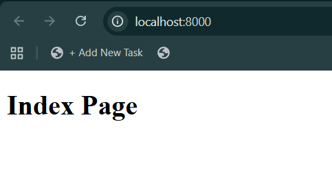
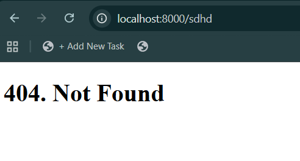
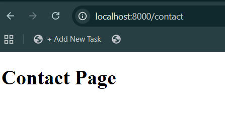
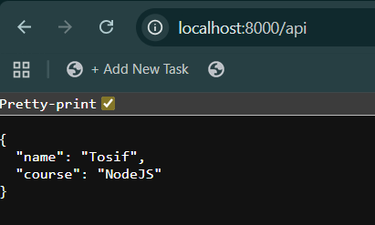
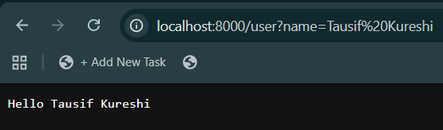
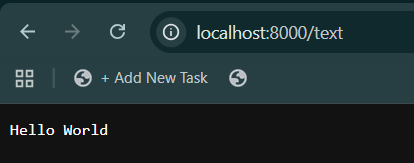

# 🚀 Custom Server

A simple and lightweight Node.js HTTP server that serves static HTML pages and provides basic API endpoints. Perfect for learning Node.js server basics or as a starting point for web applications! 🌟

## ✨ Features

- 🏠 Serve static HTML pages (Home, About, Contact)
- 🚫 Custom 404 error page
- 📡 RESTful API endpoints for JSON and text responses
- 👤 Personalized greetings with query parameters
- ⚡ Built with native Node.js HTTP module (no frameworks)
- 🔄 Easy to extend and customize

## 📦 Installation

1. Clone the repository:
   ```bash
   git clone <repository-url>
   cd 1.custom-server
   ```

2. Install dependencies:
   ```bash
   npm install
   ```

## 🚀 Usage

Start the development server:
```bash
npm run dev
```

Or run directly:
```bash
node index.js
```

The server will start on `http://localhost:8000` 🌐

## 📡 API Endpoints

| Endpoint | Method | Description | Response |
|----------|--------|-------------|----------|
| `/` | GET | Home page | HTML |
| `/about` | GET | About page | HTML |
| `/contact` | GET | Contact page | HTML |
| `/api` | GET | JSON API | `{"name": "Tosif", "course": "NodeJS"}` |
| `/text` | GET | Plain text response | `"Hello World"` |
| `/user?name=YourName` | GET | Personalized greeting | `"Hello YourName"` |
| `/*` | GET | 404 page | HTML |

## 📸 Screenshots

### 🏠 Home Page


### 📖 About Page


### 📞 Contact Page


### 🚫 404 Error Page


### 📡 API Response


### 💬 Hello User


### 📝 Plain Text Message


## 🛠️ Technologies Used

- 🟢 Node.js
- 📜 JavaScript (ES6+)
- 🌐 HTTP Module
- 📁 File System Module
- 🔍 Query String Module

## 🤝 Contributing

Contributions are welcome! 🎉 Feel free to submit a Pull Request.

## 📄 License

This project is licensed under the ISC License. 📜

---

Made with ❤️ by Tosif</content>
<parameter name="filePath">c:\FullStack Devloper\NodeJS\NodeJS-Projects\1. Custom-Server\README.md