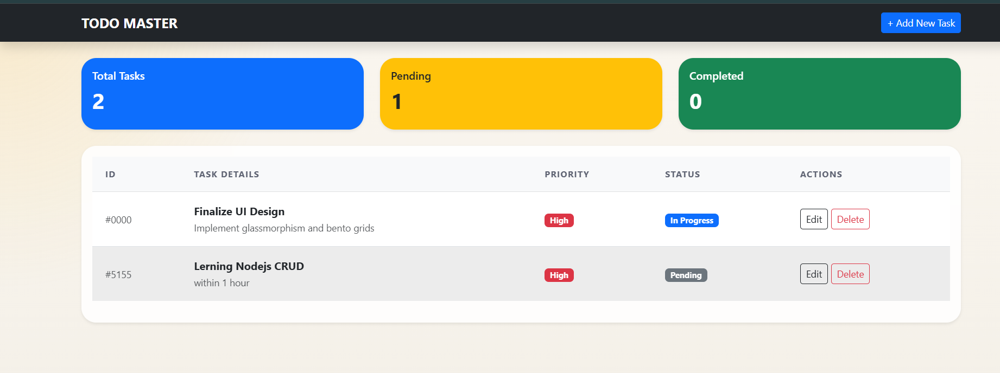
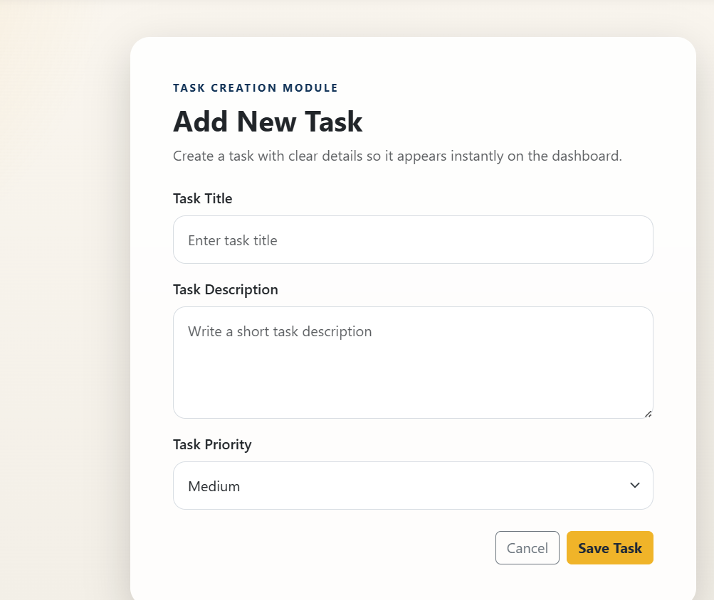

# 📝 To-Do List App

A simple and elegant **Real-Time Todo Management System** built with Node.js, Express, and EJS. Manage your tasks efficiently with a clean, intuitive interface! 🚀

## ✨ Features

- ✅ **Add Tasks**: Create new tasks with title, description, and priority
- ✏️ **Edit Tasks**: Update existing tasks seamlessly
- 🗑️ **Delete Tasks**: Remove completed or unwanted tasks
- 📊 **Dashboard**: View all tasks with status overview
- 🎯 **Priority Levels**: Set tasks as Low, Medium, or High priority
- 📈 **Statistics**: Track total, pending, and completed tasks
- 🎨 **Modern UI**: Beautiful design with responsive layout

## 🛠️ Technologies Used

- **Backend**: Node.js, Express.js
- **Frontend**: EJS templating, CSS
- **Runtime**: JavaScript (ES6+)

## 🚀 Installation & Setup

### Prerequisites
- Node.js (v14 or higher)
- npm or yarn

### Steps
1. **Clone the repository** 📥
   ```bash
   git clone <repository-url>
   cd 2.-to-do-list
   ```

2. **Install dependencies** 📦
   ```bash
   npm install
   ```

3. **Start the application** ▶️
   ```bash
   npm start
   ```
   Or for development with auto-reload:
   ```bash
   npm run dev
   ```

4. **Open your browser** 🌐
   Navigate to `http://localhost:8000`

## 📸 Screenshots

### 🏠 Dashboard


### ➕ Add Task


## 📖 Usage

- **View Tasks**: Visit the homepage to see all your tasks and statistics
- **Add Task**: Click "Add Task" to create a new task
- **Edit Task**: Click the edit button on any task to modify it
- **Delete Task**: Click the delete button to remove a task
- **Mark Complete**: Update task status to track progress

## 🤝 Contributing

Contributions are welcome! 🎉

1. Fork the repository
2. Create a feature branch (`git checkout -b feature/amazing-feature`)
3. Commit your changes (`git commit -m 'Add amazing feature'`)
4. Push to the branch (`git push origin feature/amazing-feature`)
5. Open a Pull Request

## 📄 License

This project is licensed under the ISC License - see the [LICENSE](LICENSE) file for details.

## 👨‍💻 Author

Built with ❤️ by Tosif Kureshi

---

⭐ **Star this repo** if you found it helpful!</content>
<parameter name="filePath">c:\FullStack Devloper\NodeJS\NodeJS-Projects\2. To-do-list\README.md