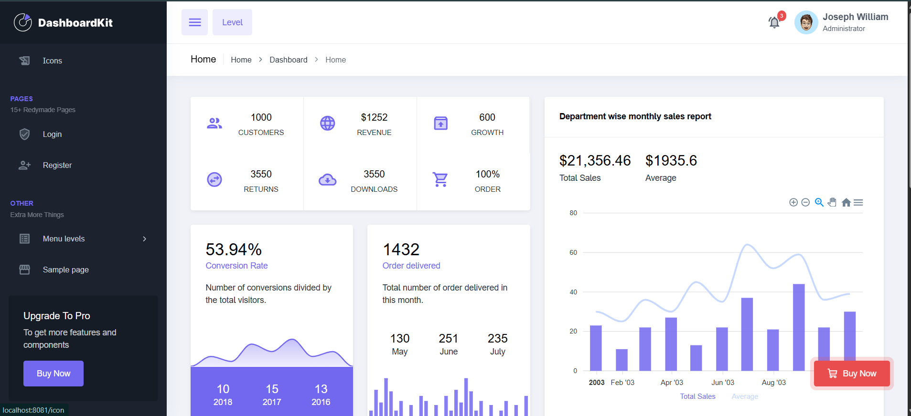

# Admin EJS Panel 🚀

A Node.js admin dashboard converted to use **EJS** templates for rendering the admin panel views.

## 🔧 Project Overview

- `app.js` — main Express application entrypoint
- `routes/` — route definitions for handling pages
- `controllers/` — controller logic for the dashboard
- `views/` — EJS templates and partials for admin panel pages
- `public/` — static assets (CSS, JS, images, fonts)

## 🚀 Features

- Admin dashboard UI converted to **EJS**
- Modular view partials for **header**, **sidebar**, **footer**, and more
- Uses Express with server-side rendering
- Includes a modern admin theme with responsive layout support

## 📸 Screenshot



## 📦 Dependencies

- `express` — web server framework
- `ejs` — templating engine for rendering views
- `nodemon` — development auto-reload utility

## 👤 Author

- Tosif Kureshi

## ▶️ Run Locally

```bash
npm install
npm run dev
```

Then open:

```text
http://localhost:3000
```

> If your app uses a different port, update the browser URL accordingly.

## 🧩 Notes

- The admin panel layout and pages are built as EJS templates inside `views/`
- Static assets are served from `public/`
- Add or modify pages by updating EJS files and route/controller logic

## ✨ Tips

- Keep reusable layout pieces in `views/partials/`
- Use Express routing to organize admin pages cleanly
- Use `nodemon` for fast development refreshes
