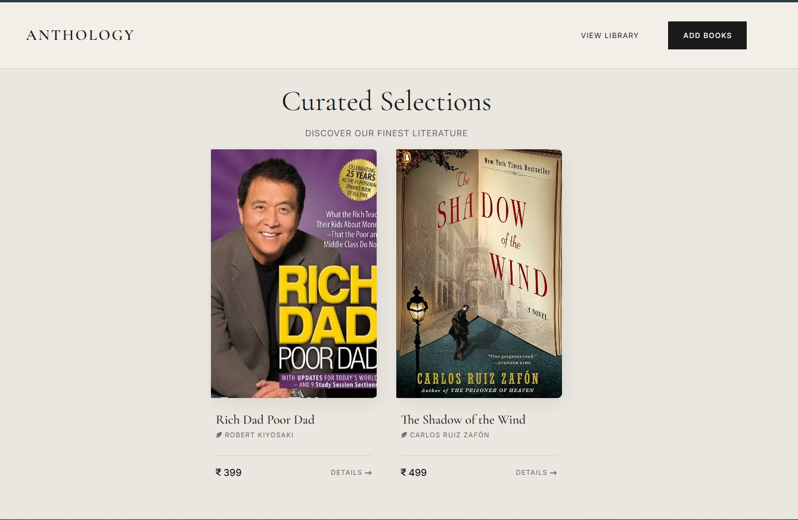
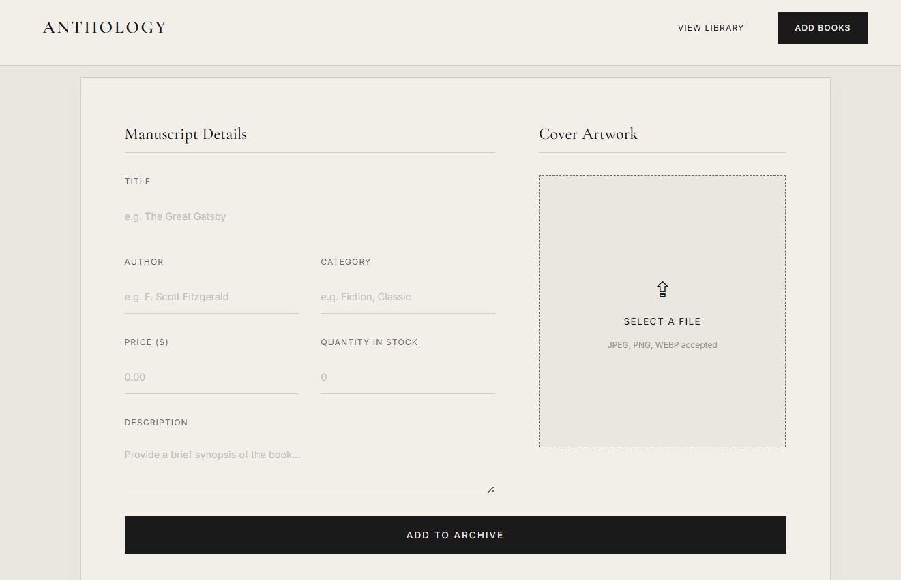
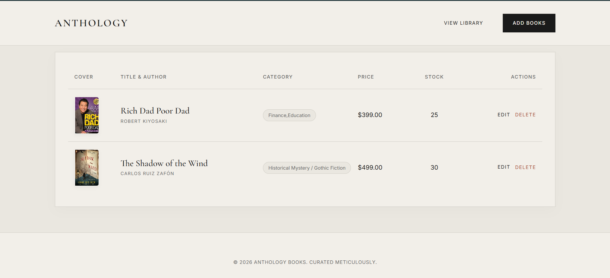

# 📚 Book Store Web App

A clean and modern **Book Store web application** built using **Node.js, Express, EJS, MongoDB, and Multer** 🚀

This app allows users to **add, view, update, and delete books**, along with uploading and managing **book cover images**.

---

## ✨ Features

* 📖 Add new books with full details and cover image upload
* 🖼️ Upload and store images using **Multer**
* 🏠 Display books on the home page in responsive cards
* 🔍 View detailed information for a single book
* 📋 Manage books in an inventory table
* ✏️ Edit book details (with image replacement support)
* ❌ Delete books and their associated images
* 📂 Store images locally in `public/uploads`
* 📱 Fully responsive UI with EJS + CSS

---

## 🛠️ Tech Stack

* ⚙️ Node.js
* 🚀 Express.js
* 🎨 EJS (Templating Engine)
* 🍃 MongoDB
* 🧩 Mongoose
* 📤 Multer (Image Uploads)
* 🎯 CSS

---

## 📁 Project Structure

```bash
4. Book Store/
│
├── config/
│   └── db.js
│
├── controllers/
│   └── bookController.js
│
├── model/
│   └── bookSchema.js
│
├── public/
│   ├── assets/
│   │   ├── images/
│   │   │   ├── addBook.png
│   │   │   ├── home.png
│   │   │   ├── updateBook.png
│   │   │   └── viewCard.png
│   │   └── styles/
│   │       └── style.css
│   │
│   └── uploads/   # 📌 Uploaded images stored here
│
├── routes/
│   └── booksRoute.js
│
├── views/
│   ├── pages/
│   │   ├── Home.ejs
│   │   ├── addBook.ejs
│   │   ├── editBook.ejs
│   │   ├── singleBook.ejs
│   │   └── viewBooks.ejs
│   │
│   └── partials/
│       ├── footer.ejs
│       ├── head.ejs
│       └── navbar.ejs
│
├── index.js
├── package.json
└── README.md
```

---

## 📸 Screenshots

### 🏠 Home Page



### ➕ Add Book



### 📋 View Books



### ✏️ Update Book


---

## ⚙️ Installation & Setup

### 1️⃣ Clone the repository

```bash
git clone <your-repository-url>
cd "4. Book Store"
```

### 2️⃣ Install dependencies

```bash
npm install
```

### 3️⃣ Setup MongoDB

Make sure MongoDB is running locally:

```bash
mongodb://localhost:27017/BookStoreDB
```

### 4️⃣ Run the project

```bash
npm run dev
```

### 5️⃣ Open in browser

```
http://localhost:8081
```

---

## 🌐 Available Routes

| Method | Route            | Description                   |
| ------ | ---------------- | ----------------------------- |
| GET    | `/`              | 🏠 Show all books (Home Page) |
| GET    | `/book/:id`      | 🔍 View single book           |
| GET    | `/add-Book`      | ➕ Add book form               |
| POST   | `/add-Book`      | 📤 Save new book              |
| GET    | `/view-Book`     | 📋 View inventory             |
| GET    | `/edit-Book/:id` | ✏️ Edit book form             |
| POST   | `/edit-Book/:id` | 🔄 Update book                |
| POST   | `/delete/:id`    | ❌ Delete book                 |

---

## 📚 Book Data Fields

Each book contains:

* 🏷️ Title
* ✍️ Author
* 🗂️ Category
* 💰 Price
* 🔢 Quantity
* 📝 Description
* 🖼️ Image

---

## ⚠️ Important Notes

* 📂 Uploaded images are stored in `public/uploads`
* 🔌 Database connection is configured in `config/db.js`
* 🖥️ Server runs on port **8081**
* ❗ MongoDB must be running before starting the app

---

## 🚀 Future Improvements

* ☁️ Cloud image upload (Cloudinary)
* 🔐 Authentication (Admin login)
* 🔎 Search & filter books
* ❤️ Wishlist / Favorites
* 🛒 Add to cart system

---

## 👨‍💻 Author

Built with ❤️ by **Tosif Kureshi** as a **Node.js CRUD Project**
