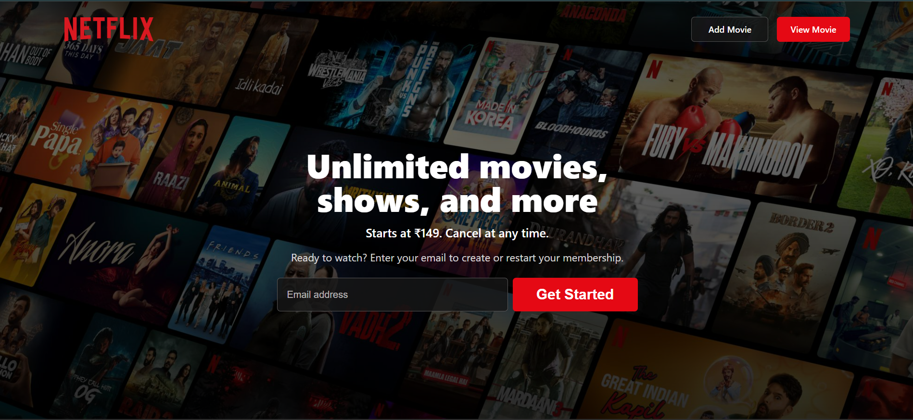
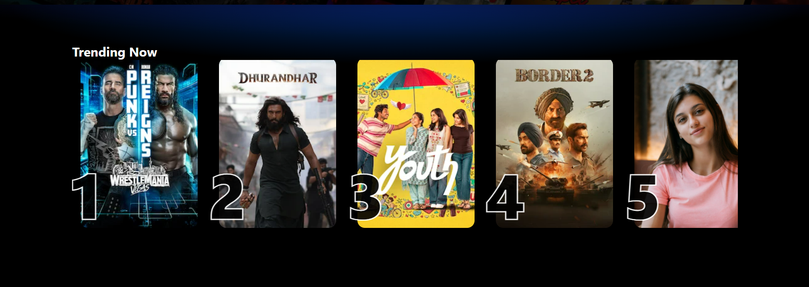
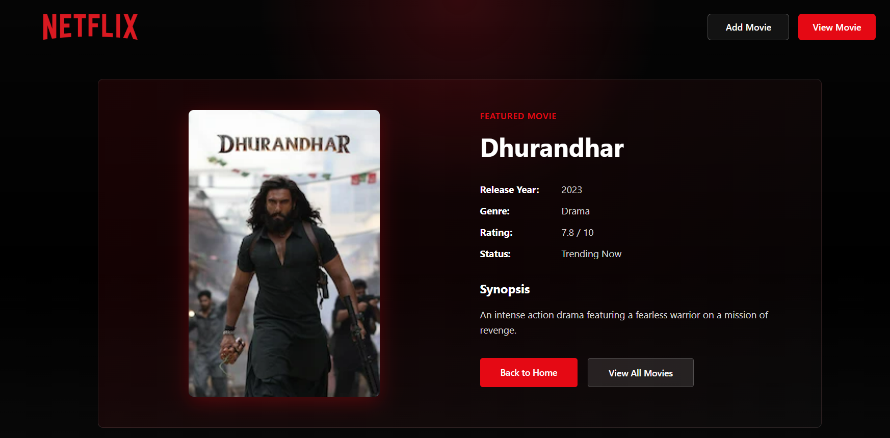
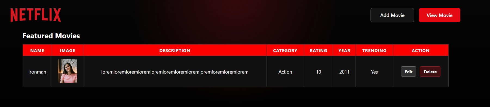
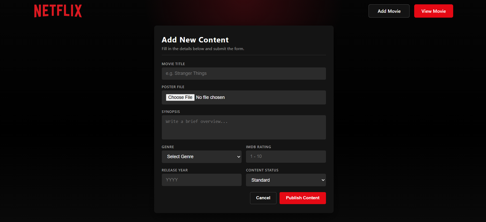
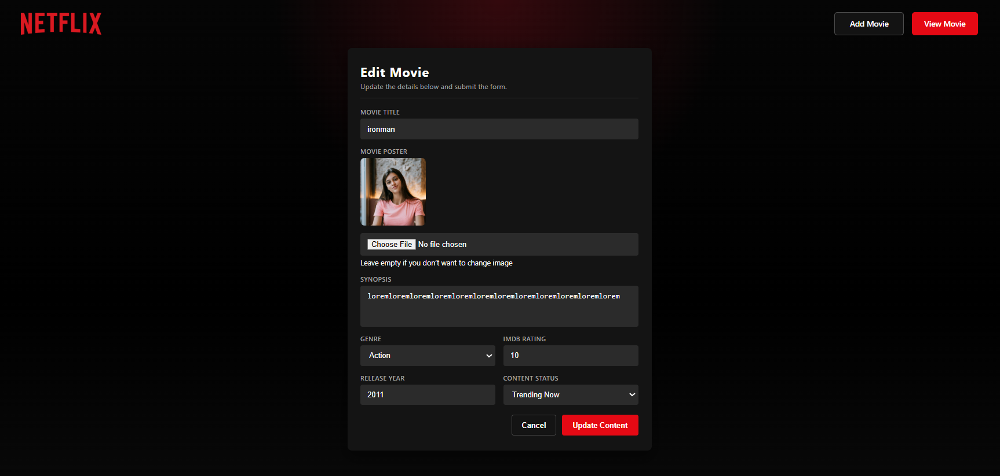
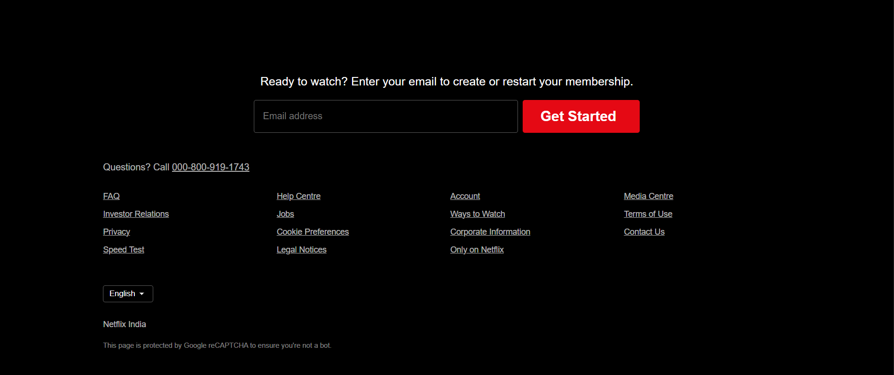

# 🎬 Netflix Clone

A dynamic Netflix-style movie web application built with **Node.js**, **Express.js**, **MongoDB**, **EJS**, and **Multer**. Users can view featured movies, add new movies with poster uploads, edit movie details, preview images before uploading, and delete movies from the collection.

## ✨ Features

- 🏠 Netflix-inspired home page
- 🔥 Trending movie section
- 🎞️ Single movie details page
- ➕ Add movie with image upload
- 👀 Live image preview before upload
- ✏️ Edit movie details and poster
- 🗑️ Delete movies
- 📁 Static and uploaded image support
- 🧩 EJS partials for reusable layout
- 🗄️ MongoDB database integration

## 🛠️ Tech Stack

- **Backend:** Node.js, Express.js
- **Database:** MongoDB, Mongoose
- **Template Engine:** EJS
- **File Upload:** Multer
- **Styling:** HTML, CSS
- **Development Tool:** Nodemon

## 📂 Project Structure

```text
Netflix-Clone/
├── config/
│   ├── db.js
│   └── multer.js
├── controller/
│   └── movieController.js
├── model/
│   └── movieSchema.js
├── public/
│   ├── css/
│   ├── images/
│   ├── screenshot/
│   └── uploads/
├── routes/
│   └── movieRoute.js
├── view/
│   ├── pages/
│   └── partials/
├── index.js
├── package.json
└── README.md
```

## 📸 Screenshots

### Home Page



### Movie Cards



### Single Movie Page



### View Movies Page



### Add Movie Page



### Edit Movie Page



### Footer



## 🚀 Getting Started

### 1. Clone the repository

```bash
git clone <your-repository-url>
cd Netflix-Clone
```

### 2. Install dependencies

```bash
npm install
```

### 3. Start MongoDB

Make sure MongoDB is running locally. The app connects to:

```text
mongodb://localhost:27017/MoviesDB
```

### 4. Run the project

```bash
npm run dev
```

### 5. Open in browser

```text
http://localhost:8081
```

## 📌 Main Routes

| Route | Description |
| --- | --- |
| `/` | Home page |
| `/movies/view` | View all movies |
| `/movies/view/:id` | Single movie details |
| `/movies/add` | Add movie page |
| `/movies/edit/:id` | Edit movie page |
| `/movies/delete/:id` | Delete movie |

## 🖼️ Image Upload Notes

- Uploaded movie posters are stored in `public/uploads/`.
- Static featured movie images are stored in `public/images/`.
- Add and edit pages include live image preview before submitting the form.

## 👨‍💻 Author

**Tosif Kureshi**

## 📄 License

This project is licensed under the **ISC License**.
