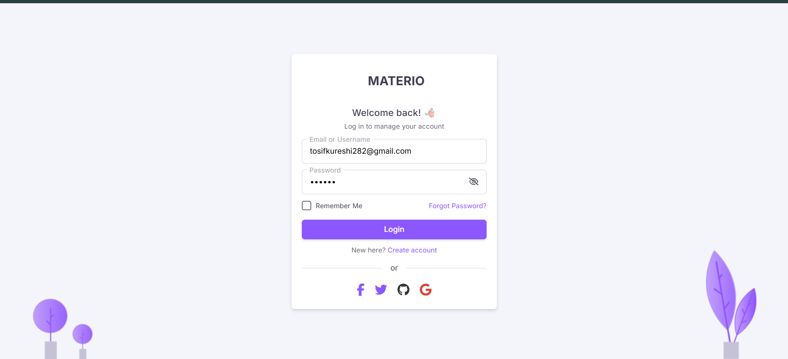
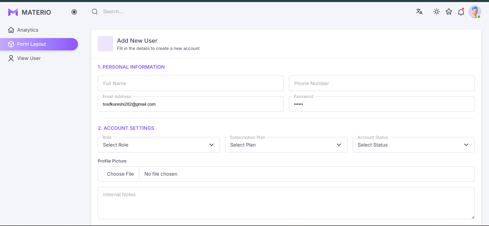

# 🧩 Admin Panel EJS with Passport

A clean and practical admin dashboard built with **Node.js**, **Express.js**, **MongoDB**, **EJS**, and **Passport.js**.  
It includes Passport local authentication, session-based login, user CRUD, profile management, profile image uploads, image previews, dark/light theme support, and a Materio Bootstrap dashboard UI.

## 📸 Screenshots

### 🔐 Login Page


### 📊 Dashboard


### ➕ Add User


### 👥 User List


### 👤 User Profile


## ✨ Features

- 🔐 Login and registration with Passport Local Strategy
- 🛡️ Session-based authentication using `express-session`
- 🔑 Password hashing with `bcrypt`
- 👤 Logged-in user profile page
- 🧾 Add, view, edit, update, and delete users
- 🖼️ Profile image upload with `multer`
- ♻️ Old uploaded image cleanup when a profile image is updated
- 👀 Live image preview before adding a user
- 📊 Dashboard UI using Materio Bootstrap assets
- 🌗 Light, dark, and system theme switcher
- 🧩 Reusable EJS partials for header, navbar, sidebar, footer, and scripts
- 📁 Static assets served from the `public` folder

## 🛠️ Tech Stack

- 🟢 Node.js
- 🚀 Express.js
- 🧩 EJS
- 🍃 MongoDB
- 🔗 Mongoose
- 🛂 Passport.js
- 🧭 Passport Local Strategy
- 🛡️ Express Session
- 🔐 Bcrypt
- 🖼️ Multer
- 🎨 Bootstrap / Materio UI assets

## 📁 Project Structure

```text
.
|-- config/
|   |-- db.js
|   `-- passport.js
|-- controller/
|   `-- adminController.js
|-- model/
|   `-- adminSchema.js
|-- public/
|   |-- assets/
|   |-- screenshot/
|   `-- uploads/
|-- routes/
|   `-- adminRoute.js
|-- views/
|   |-- pages/
|   `-- partials/
|-- index.js
|-- package.json
`-- README.md
```

## ✅ Requirements

- 🟢 Node.js installed
- 📦 npm installed
- 🍃 MongoDB running locally

Current MongoDB connection:

```js
mongodb://localhost:27017/adminDB
```

You can change it in `config/db.js`.

## 🚀 Installation

Install dependencies:

```bash
npm install
```

Start the development server:

```bash
npm run dev
```

Open the app:

```text
http://localhost:8081
```

## 🔑 Authentication Flow

This version uses **Passport.js** instead of manual cookie authentication.

- `passport-local` checks email and password.
- `bcrypt` compares the entered password with the hashed password.
- `express-session` stores the logged-in user session.
- `req.isAuthenticated()` protects private routes.
- `req.user` contains the current logged-in user.
- `req.logout()` logs the user out safely.

## 🧭 Main Routes

| Method | Route | Description |
| --- | --- | --- |
| GET | `/login` | Login page |
| POST | `/login` | Login with Passport |
| GET | `/register` | Register page |
| POST | `/register` | Create account and login |
| GET | `/logout` | Logout current user |
| GET | `/` | Dashboard |
| GET | `/dashboard` | Dashboard |
| GET | `/profile` | Current user profile |
| POST | `/profile` | Update current user profile |
| GET | `/form-layout` | Add user page |
| POST | `/users/add` | Create new user |
| GET | `/users` | User list |
| GET | `/users/edit/:id` | Edit user page |
| POST | `/users/update/:id` | Update user |
| POST | `/users/delete/:id` | Delete user |

## 🧾 User Model

Users are stored with:

- `fullName`
- `phoneNumber`
- `email`
- `password`
- `role`
- `plan`
- `status`
- `Image`
- `note`

Uploaded images are stored in:

```text
public/uploads
```

## 📜 Scripts

```bash
npm run dev
```

Runs the app with Nodemon.

## ⚠️ Production Notes

- Move session secret into an environment variable.
- Use MongoDB Atlas or a secured production MongoDB server.
- Add stricter file validation for uploads.
- Add form validation for all create/update routes.
- Use a persistent session store instead of the default memory store.
- Avoid hardcoding database URLs in production.

## 🙌 Credits

UI assets are based on the **Materio Bootstrap Admin Template** by ThemeSelection.

## 👨‍💻 Author

Made with ❤️ by **Tosif Kureshi**
