# 🚀 Materio Admin Panel — Secure EJS Dashboard with Passport Auth & Role-Based Access Control (RBAC)

A clean, practical, and feature-rich admin dashboard and multi-level catalog management system built with **Node.js**, **Express.js**, **MongoDB**, **EJS**, and **Passport.js**.  
It includes Passport local authentication, role-based access control (RBAC), password recovery via email OTP, comprehensive CRUD management for users and catalog entities, image uploads, light/dark theme support, and a modern Materio Bootstrap dashboard UI.

## ✨ Features

- 🔐 **Passport Local Authentication**: Secure login, registration, and logout using Passport Local Strategy.
- 🛡️ **Session Management & Cookie Parsing**: Session-based login tracking utilizing `express-session` and `cookie-parser`.
- 🔑 **Password Security**: Password hashing with `bcrypt` (10 salt rounds) and secure password change routes.
- 📧 **Password Recovery via Email OTP**: Secure forgot-password flow with `nodemailer` integration sending a 6-digit OTP, SHA-256 hashing for verification, and a 2-minute session expiration.
- 👑 **Role-Based Access Control (RBAC)**: Fine-grained permissions mapping to roles (*Super Admin*, *Admin*, *Manager*, and *User*) to dynamically show/hide sidebar menus and enforce route-level authorization.
- 👥 **Admin/User CRUD**: Create, read, update, soft delete, restore, and permanently delete system users.
- 🖼️ **Profile & Product Image Uploads**: Multer-driven profile and product image uploads with automatic cleanup of old images from the server filesystem upon updates/deletion.
- 📁 **Multi-Level Nested Catalog**: Complete category classification tree:
  - **Category** (Main Category)
  - **Subcategory** (Nested under Category)
  - **Extra Category** (Nested under Subcategory & Category)
  - **Product** (Contains image, price, and maps to the triple-nested category path)
- ♻️ **Soft Delete & Archive Bin**: Recycle-bin functionality across all primary entities (Admins, Categories, Subcategories, Extra Categories, Products) preventing accidental data loss.
- 🌗 **Light, Dark, and System Theme Switcher**: Theme selection integrated with Materio Bootstrap assets.
- 🔔 **Contextual Flash Messages**: Alert notifications (Success, Error, Warning, Info) powered by `connect-flash`.
- 🧩 **Reusable View Partials**: Modular EJS layouts including header, navbar, sidebar, footer, and scripts.

---

## 🛠️ Tech Stack

- **Backend Runtime**: [Node.js](https://nodejs.org/)
- **Web Framework**: [Express.js](https://expressjs.com/) (v5.x)
- **Database**: [MongoDB](https://www.mongodb.com/) via [Mongoose ODM](https://mongoosejs.com/)
- **Authentication**: [Passport.js](https://www.passportjs.org/) & [Passport-Local Strategy](https://github.com/jaredhanson/passport-local)
- **Hashing**: [Bcrypt](https://github.com/kelektiv/node.bcrypt.js)
- **Email Service**: [Nodemailer](https://nodemailer.com/)
- **File Uploads**: [Multer](https://github.com/expressjs/multer)
- **Session & Flash**: [Express Session](https://github.com/expressjs/session), [Connect Flash](https://github.com/jaredhanson/connect-flash)
- **View Engine**: [EJS](https://ejs.co/) (Embedded JavaScript)
- **UI Assets**: Materio Bootstrap Admin Template

---

## 📁 Project Structure

```text
.
|-- config/
|   |-- db.js                      # MongoDB connection setup
|   `-- passport.js                # Passport authentication configuration
|-- controller/
|   |-- adminController.js         # Controls Auth, User CRUD, OTP, Profile, Dashboard
|   |-- categoryController.js      # Controls Categories CRUD & Archive
|   |-- subcateController.js       # Controls Subcategories CRUD & Archive
|   |-- extraCateController.js     # Controls Extra Categories CRUD & Archive
|   `-- productController.js       # Controls Products CRUD, Image Upload, & Archive
|-- middleware/
|   `-- roleMiddleware.js          # Role configuration, permission lists, RBAC checks
|-- model/
|   |-- adminSchema.js             # User/Admin schema model
|   |-- categorySchema.js          # Main Category schema model
|   |-- subcateSchema.js           # Subcategory schema model (references Category)
|   |-- extraCateSchema.js         # Extra Category schema (references Category & Subcategory)
|   `-- productSchema.js           # Product schema (references Category, Subcategory, & ExtraCategory)
|-- public/
|   |-- assets/                    # Materio CSS, JS, and font assets
|   |-- screenshot/                # UI Screenshot assets
|   `-- uploads/                   # Uploaded profile & product image storage
|-- routes/
|   |-- adminRoute.js              # Routing for Auth, Users, OTP, & Dashboard
|   |-- categoryRoutes.js          # Routing for Category operations
|   |-- subcateRoute.js            # Routing for Subcategory operations
|   |-- extraCateRoutes.js         # Routing for Extra Category operations
|   `-- productRoutes.js           # Routing for Product operations
|-- views/
|   |-- pages/                     # EJS pages (Auth, Profile, Categories, Products, Users)
|   `-- partials/                  # Modular EJS layouts (Navbar, Sidebar, Footer, etc.)
|-- .env                           # Environment configuration variables
|-- .gitignore                     # Git ignored files configuration
|-- index.js                       # Primary Application entry file
|-- package.json                   # Project scripts and dependencies
`-- README.md                      # Documentation
```

---

## ⚙️ Environment Configuration

Create a `.env` file in the root directory and configure the following variables:

```ini
PORT=8081
MONGO_URL=mongodb://localhost:27017/adminDB
GMAIL_USER=your-email@gmail.com
GMAIL_APP_PASSWORD=your-gmail-app-password
```

> [!NOTE]
> `GMAIL_APP_PASSWORD` must be a 16-character Google App Password (not your regular account password) for nodemailer to connect successfully.

---

## 🚀 Installation & Run

### 1. Requirements
- Node.js (v16.x or higher recommended)
- MongoDB running locally or a MongoDB Atlas URI

### 2. Install Dependencies
```bash
npm install
```

### 3. Start Development Server
```bash
npm run dev
```

### 4. Access Application
Open your browser and navigate to:
```text
http://localhost:8081
```

---

## 🛡️ Role-Based Access Control (RBAC)

The application enforces a role hierarchy to restrict sections and pages based on user roles:

| Feature / Resource | Super Admin | Admin | Manager | User |
| :--- | :---: | :---: | :---: | :---: |
| **System Dashboard** | ✅ | ✅ | ✅ | ✅ |
| **Manage Self Profile** | ✅ | ✅ | ✅ | ✅ |
| **System User CRUD** | ✅ | ❌ | ❌ | ❌ |
| **Category Management** | ✅ | ✅ | ❌ | ❌ |
| **Subcategory Management**| ✅ | ✅ | ❌ | ❌ |
| **Extra Category Mgmt** | ✅ | ✅ | ❌ | ❌ |
| **View Products List** | ✅ | ✅ | ✅ | ✅ |
| **Add / Edit Products** | ✅ | ✅ | ✅ | ❌ |
| **Delete / Archive Products**| ✅ | ✅ | ❌ | ❌ |

Authentication and role checks are managed by `isAuth` and `requirePermission()` helper functions defined in `middleware/roleMiddleware.js`.

---

## 🧭 Application Routes Map

### 🔐 Authentication & Profile

| Method | Route | Permission Required | Description |
| :--- | :--- | :--- | :--- |
| **GET** | `/login` | Public | Render Login page |
| **POST**| `/login` | Public | Submit credentials to authenticate user |
| **GET** | `/register` | Public | Render Registration page |
| **POST**| `/register` | Public | Create new registration account |
| **GET** | `/logout` | Public | Clean session and log user out |
| **GET** | `/forgot-password`| Public | Render forgot password email submission page |
| **POST**| `/forgot-password`| Public | Search email, generate 6-digit OTP, send email |
| **GET** | `/verify-otp` | Public | Render OTP verification form page |
| **POST**| `/verify-otp` | Public | Validate OTP session and match hashed OTP code |
| **GET** | `/resend-otp` | Public | Reset timer and send a new OTP code |
| **GET** | `/reset-password` | Public | Render password reset input page (OTP verified only) |
| **POST**| `/reset-password` | Public | Save new hashed password |
| **GET** | `/` or `/dashboard`| `dashboard:view` | View primary stats dashboard |
| **GET** | `/profile` | `profile:manage` | View authenticated user profile details |
| **POST**| `/profile` | `profile:manage` | Update profile details and upload new image |
| **GET** | `/change-password`| `profile:manage` | Render password modification form |
| **POST**| `/change-password`| `profile:manage` | Submit and update account password |

### 👥 User Administration (Super Admin Only)

| Method | Route | Description |
| :--- | :--- | :--- |
| **GET** | `/form-layout` | Render new admin/user creation form |
| **POST**| `/users/add` | Save new user record with profile image upload |
| **GET** | `/users` | Display active user records table |
| **GET** | `/users/edit/:id` | Render user update details form |
| **POST**| `/users/update/:id`| Save updated user attributes and handle profile image swap |
| **POST**| `/users/delete/:id`| Soft delete (archive) user profile |
| **GET** | `/users/trash` | View soft-deleted/archived user profiles |
| **POST**| `/users/restore/:id`| Restore archived user back to active list |
| **POST**| `/users/permanent-delete/:id`| Remove user from database and clean uploaded image |

### 📂 Nested Category Management (Super Admin & Admin Only)

| Method | Route | Description |
| :--- | :--- | :--- |
| **GET** | `/category/view` | View active Categories list |
| **GET** | `/category/add` | Render Category creation page |
| **POST**| `/category/add` | Save Category details |
| **GET** | `/category/edit/:id` | Render Category edit page |
| **POST**| `/category/edit/:id`| Update Category description and state |
| **GET** | `/category/delete/:id`| Soft delete Category |
| **GET** | `/category/trash` | View Category Recycle Bin |
| **GET** | `/category/restore/:id`| Restore Category to active status |
| **GET** | `/category/permanent-delete/:id`| Permanently delete Category from system |

### 📁 Subcategory Management (Super Admin & Admin Only)

| Method | Route | Description |
| :--- | :--- | :--- |
| **GET** | `/subcategory/view` | View active Subcategories list |
| **GET** | `/subcategory/add` | Render Subcategory creation form |
| **POST**| `/subcategory/add` | Create Subcategory reference under a Category |
| **GET** | `/subcategory/edit/:id` | Render Subcategory edit page |
| **POST**| `/subcategory/edit/:id`| Update Subcategory name and parent Category |
| **GET** | `/subcategory/delete/:id`| Soft delete Subcategory |
| **GET** | `/subcategory/trash` | View Subcategory Recycle Bin |
| **GET** | `/subcategory/restore/:id`| Restore Subcategory to active status |
| **GET** | `/subcategory/permanent-delete/:id`| Permanently delete Subcategory |

### 🗄️ Extra Category Management (Super Admin & Admin Only)

| Method | Route | Description |
| :--- | :--- | :--- |
| **GET** | `/extra-category/view` | View active Extra Categories list |
| **GET** | `/extra-category/add` | Render Extra Category creation form |
| **POST**| `/extra-category/add` | Link Extra Category to Category and Subcategory |
| **GET** | `/extra-category/edit/:id`| Render Extra Category edit page |
| **POST**| `/extra-category/edit/:id`| Update Extra Category mappings |
| **GET** | `/extra-category/delete/:id`| Soft delete Extra Category |
| **GET** | `/extra-category/trash` | View Extra Category Recycle Bin |
| **GET** | `/extra-category/restore/:id`| Restore Extra Category |
| **GET** | `/extra-category/permanent-delete/:id`| Permanently remove Extra Category |

### 📦 Product Catalog Management

| Method | Route | Permission Required | Description |
| :--- | :--- | :--- | :--- |
| **GET** | `/products/view` | `products:view` | Display active products list |
| **GET** | `/products/add` | `products:create` | Render Product creation form |
| **POST**| `/products/add` | `products:create` | Save Product with Category paths, price & image |
| **GET** | `/products/edit/:id`| `products:edit` | Render Product editing page |
| **POST**| `/products/edit/:id`| `products:edit` | Update Product characteristics and image swap |
| **GET** | `/products/delete/:id`| `products:delete`| Soft delete product record |
| **GET** | `/products/trash` | `products:trash` | View Product Recycle Bin |
| **GET** | `/products/restore/:id`| `products:restore`| Restore product to active status |
| **GET** | `/products/permanent-delete/:id`| `products:delete`| Permanently delete product record |

---

## 🗃️ Database Schemas & Models

### 👤 Admin/User Schema (`adminSchema`)
Stores authentication records, user profiles, status, and role metadata.
```javascript
{
  fullName:    { type: String, required: true },
  phoneNumber: { type: Number, required: true },
  email:       { type: String, required: true },
  password:    { type: String, required: true },
  role:        { type: String, required: true }, // Super Admin, Admin, Manager, User
  plan:        { type: String, required: true },
  status:      { type: String, required: true },
  Image:       { type: String },
  note:        { type: String, required: true },
  isDeleted:   { type: Boolean, default: false }
}
```

### 📂 Category Schema (`categorySchema`)
Represents root level categorization folders.
```javascript
{
  category:  { type: String, required: true },
  isActive:  { type: Boolean, default: true },
  isDeleted: { type: Boolean, default: false }
}
```

### 📁 Subcategory Schema (`subcateSchema`)
Groups nested sub-folders referencing root categories.
```javascript
{
  category:    { type: Schema.Types.ObjectId, ref: "Category", required: true },
  subcategory: { type: String, required: true, trim: true },
  isActive:    { type: Boolean, default: true },
  isDeleted:   { type: Boolean, default: false }
}
```

### 🗄️ Extra Category Schema (`extraCateSchema`)
Third level categorization for maximum granularity.
```javascript
{
  category:      { type: Schema.Types.ObjectId, ref: "Category", required: true },
  subcategory:   { type: Schema.Types.ObjectId, ref: "Subcategory", required: true },
  extraCategory: { type: String, required: true, trim: true },
  isActive:      { type: Boolean, default: true },
  isDeleted:     { type: Boolean, default: false }
}
```

### 📦 Product Schema (`productSchema`)
Represents active product items tied into the category hierarchy structure.
```javascript
{
  category:      { type: Schema.Types.ObjectId, ref: "Category", required: true },
  subcategory:   { type: Schema.Types.ObjectId, ref: "Subcategory", required: true },
  extraCategory: { type: Schema.Types.ObjectId, ref: "ExtraCategory", required: true },
  productName:   { type: String, trim: true },
  productImage:  { type: String, trim: true },
  price:         { type: Number, required: true, min: 0 },
  isActive:      { type: Boolean, default: true },
  isDeleted:     { type: Boolean, default: false }
}
```

---

## 🛠️ Project Development Scripts

- **Run in Development Mode (Nodemon Hot Reloading)**:
  ```bash
  npm run dev
  ```
- **Check Linting / Tests**:
  ```bash
  npm test
  ```

---

## ⚠️ Security & Production Notes

- **Persistent Sessions**: The project currently uses standard memory storage for express-session. For production setups, switch to a database-backed session store like `connect-mongo` or Redis.
- **Environment Separation**: Ensure database strings and mail secrets are never committed directly. Always reference `process.env`.
- **Input Validation**: Use standard middleware validators like `express-validator` to scrub and sanitize forms before passing payload details directly to the Mongoose query engine.
- **HTTPS Enforcement**: Ensure cookies are set with `secure: true` and `httpOnly: true` in production configuration blocks.

---

## 📸 Screenshots

Here is a visual walkthrough of the interface and advanced capabilities implemented across this admin panel:

### 🔐 Login Page


### 📊 Dashboard


### ➕ Add User


### 👥 User List
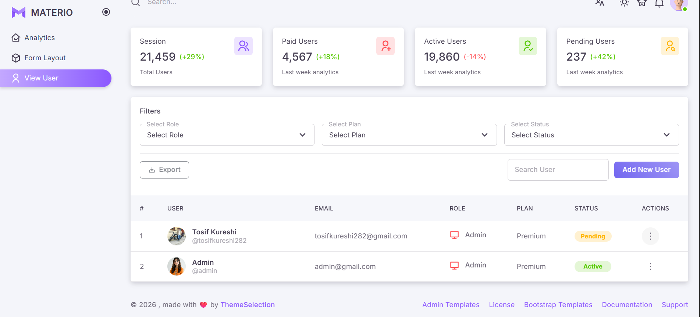

### 👤 User Profile
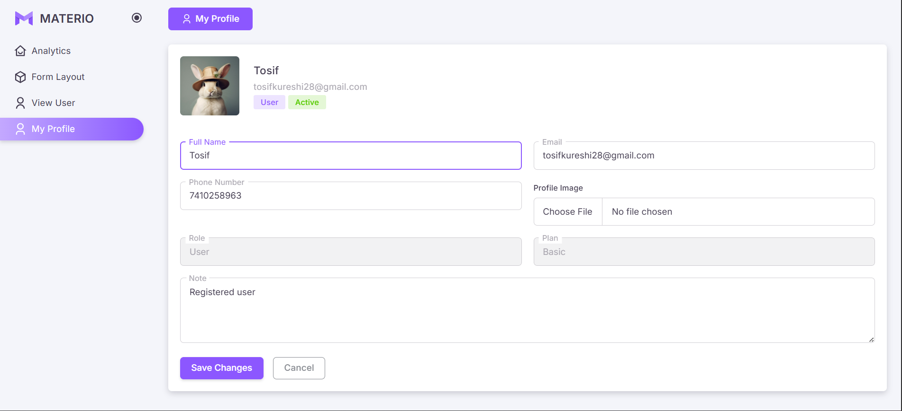

---

### 👑 Role-Based Sidebar Access (RBAC)
Depending on your user role, the navigation menu dynamically adapts to show only the authorized sections:

| Super Admin | Admin | Manager | User |
| :---: | :---: | :---: | :---: |
| 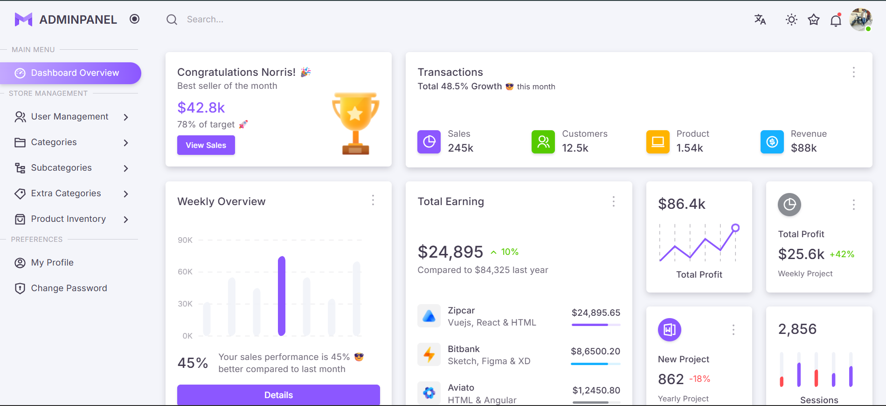 | 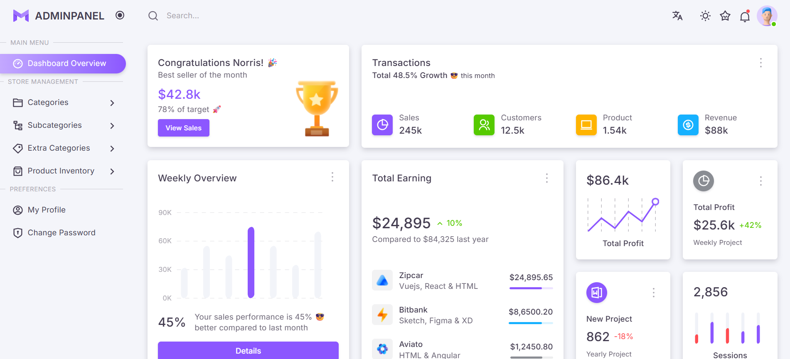 | 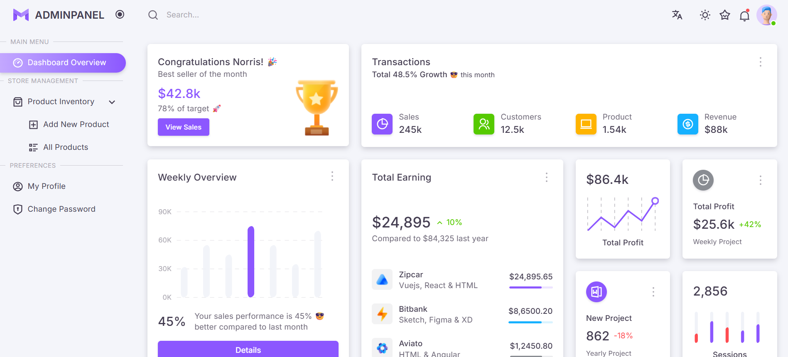 | 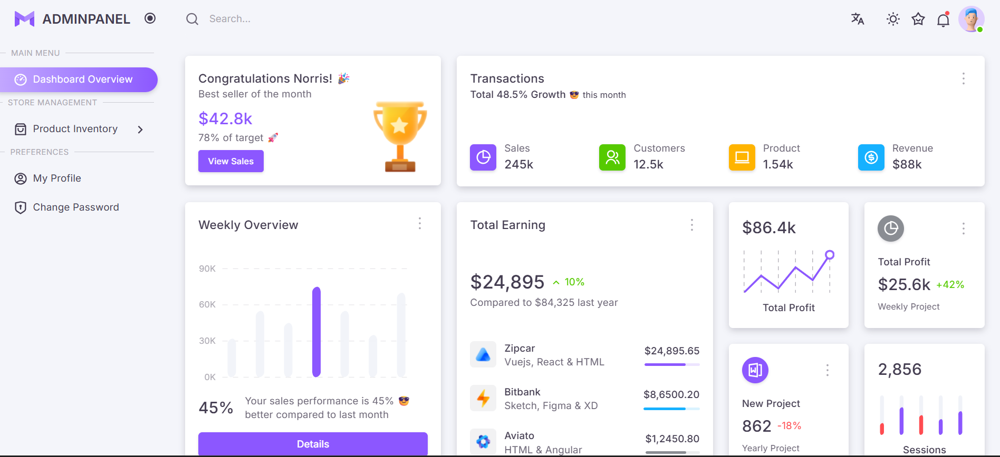 |

---

### 📧 Forgot Password & OTP Flow
A secure, email-driven password recovery system integrated with Gmail SMTP:

#### 1. Password Reset Request Form
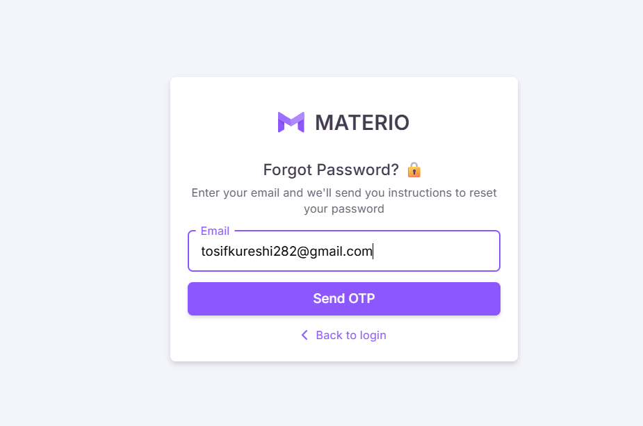

#### 2. OTP Sent to Gmail Inbox
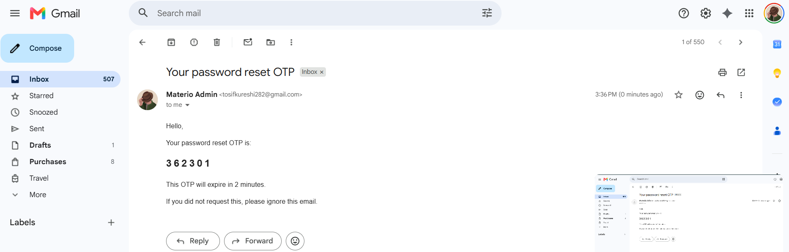

#### 3. OTP Verification Form
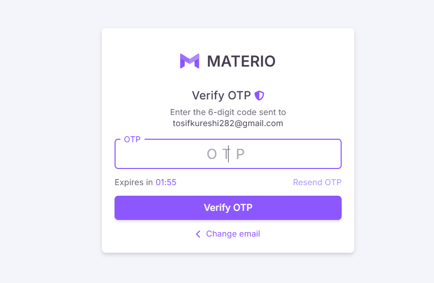

#### 4. Change Password Form (Logged-in User Security)
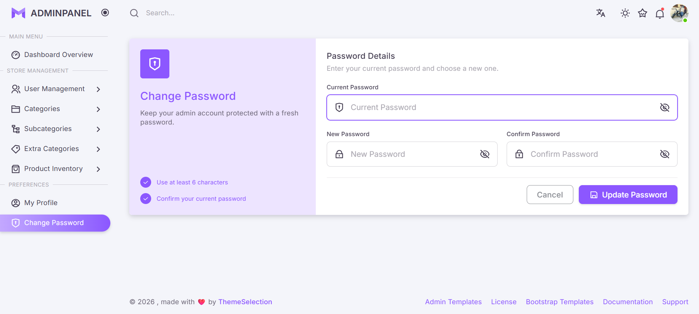

---

### 📂 Nested Category Management
Full lifecycle support for 3-tiered category mappings:

#### 1. Create Category
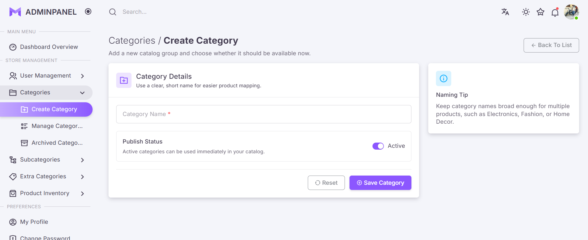

#### 2. Manage Active Categories
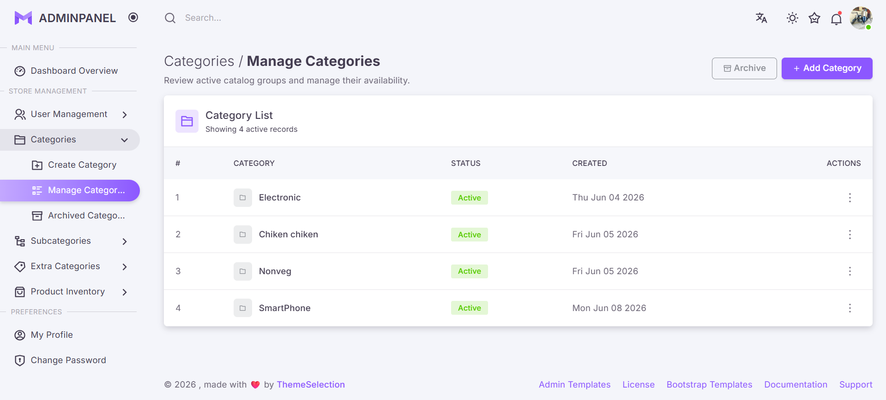

#### 3. Edit Category
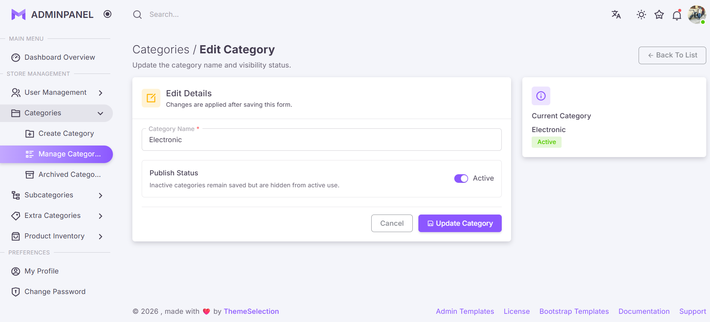

#### 4. Category Archive Recycle Bin (Soft Delete)
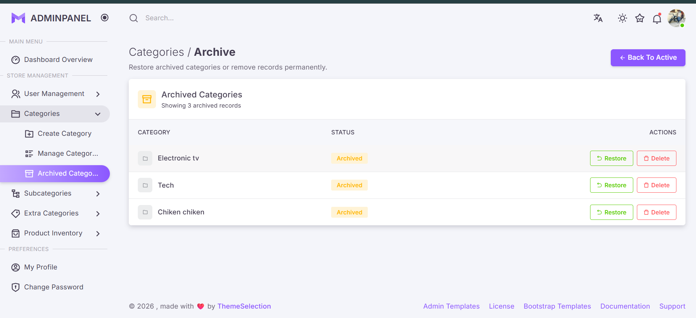

---

### 📦 Product Inventory Management
Complete control over product cataloging, pricing, dynamic categories, and file uploads:

#### 1. Add Product Form (Dynamic Select Chain)
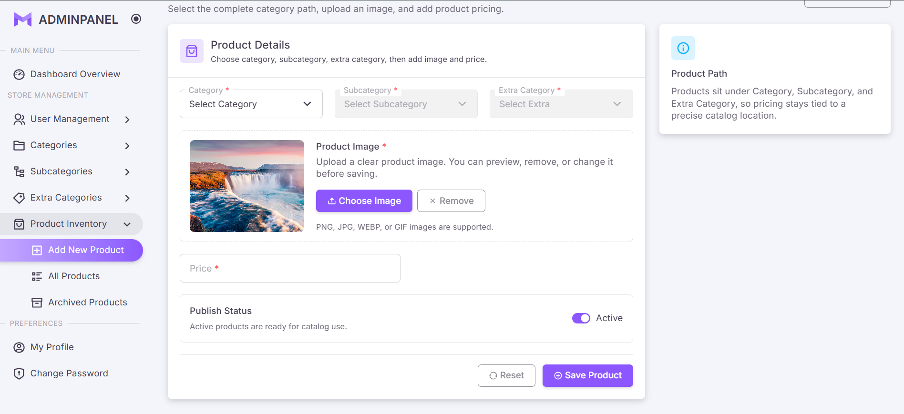

#### 2. Edit Product Form
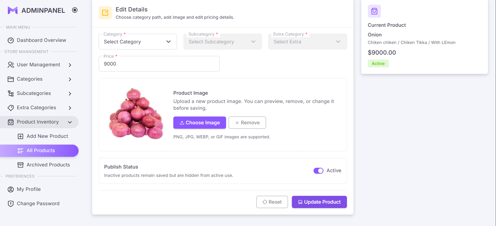

#### 3. Product Inventory (Grid/Card View with Image Cards)
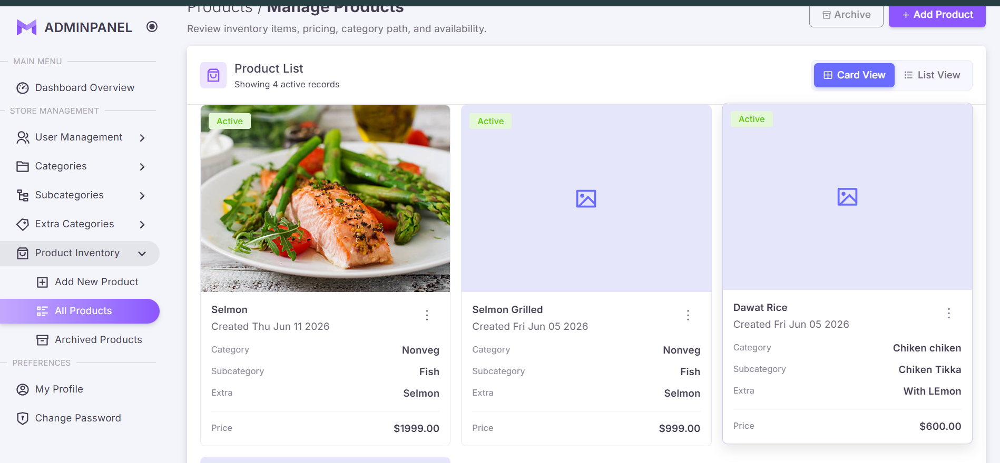

#### 4. Product Archive Recycle Bin (Soft Delete)
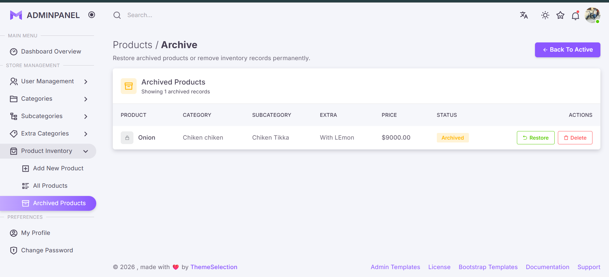

---

### 🗑️ Soft Delete Recycle Bins
All models support soft-deletion, letting users archive records first:

#### Entity Trash/Recycle Bin Page
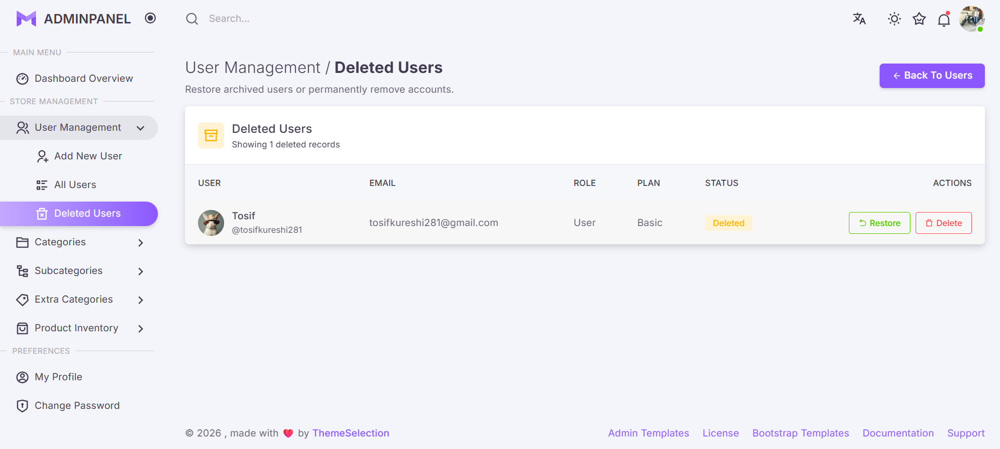

---

## 🙌 Credits

- UI template assets and styling guidelines adapted from the **Materio Bootstrap Admin Template** designed by [ThemeSelection](https://themeselection.com/).

---

## 👨‍💻 Author

Made with ❤️ by **Tosif Kureshi**
