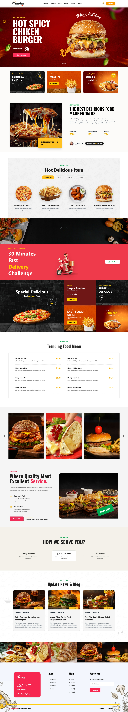

# 🍔 TasteNest - Fast Food Restaurant Website 🍕

Welcome to **TasteNest**, a premium, modern, and pixel-perfect restaurant landing page designed to wow customers at first glance! Built with top-tier design aesthetics, smooth micro-animations, and full cross-device responsiveness.

## 🎥 Presentation Video
Watch the project presentation video here: [TasteNest Presentation Video](https://drive.google.com/file/d/1zzyvKviEsU8SKePyMUWMEzVA_KosxJ3k/view?usp=sharing)

## 📸 Preview



---

## 🚀 Key Features

* **⚡ Lightning Fast Performance**: Powered by React 19 and Vite for instant load times and hot module replacement.
* **📱 Fully Responsive Design**: Seamless transitions across all screen sizes (1920px+ desktop down to 320px mobile screens) with zero overflow.
* **🧭 Mobile-Friendly Navigation**: A clean mobile hamburger menu overlay incorporating the Cart icon and "Order Now" CTA.
* **🍔 Stunning Pizza & Burger Banners**: Curated, high-contrast imagery with floating interactive graphic elements.
* **📸 Symmetric Instagram Gallery**: A customized 5-column layout on desktop/tablets that dynamically transitions to a symmetric 2x2 grid on mobile viewports.
* **✨ Curated Typography & Spacing**: Proportional Oswald typography and adjusted padding scales to ensure visual hierarchy on any device.

---

## 🛠️ Technology Stack

* **Core Framework**: React 19 ⚛️
* **Build Tooling**: Vite 8 ⚡
* **Styling Engine**: Tailwind CSS v4 🎨
* **Icon Library**: Lucide React 🛠️

---

## 📁 Project Structure

```bash
TasteNest/
├── src/
│   ├── assets/          # Curated image & pattern graphic assets
│   ├── components/      # Modular UI components
│   │   ├── AboutFood.jsx        # About food description with stats
│   │   ├── AboutUs.jsx          # Carousel-style image showcase
│   │   ├── BannerPizza.jsx      # Hero landing with burger animations
│   │   ├── Blog.jsx             # Integrated blog post cards
│   │   ├── Footer.jsx           # Balanced multi-column footer layout
│   │   ├── HeroAndDelivery.jsx  # fast-scooter promo banner
│   │   ├── InstagramGrid.jsx    # Flush food photo grid
│   │   ├── MenuGrid.jsx         # Categorized tab menu
│   │   ├── Navbar.jsx           # Responsive hamburger header
│   │   ├── PromoCards.jsx       # Side-by-side marketing grid
│   │   ├── PromoGrid.jsx        # Grid layout with specials
│   │   ├── Services.jsx         # Icon feature blocks
│   │   └── TrendingMenu.jsx     # Price list layout
│   ├── App.jsx          # App wrapper and component assembler
│   ├── App.css          # App-wide custom rules
│   ├── index.css        # Tailwind V4 core styles & Oswald font
│   └── main.jsx         # React application mount point
├── public/              # Static public resources
└── index.html           # HTML5 entry point template
```

---

## 💻 Installation & Getting Started

Follow these steps to run the project locally on your machine:

### 1. Clone the repository
```bash
git clone <repository-url>
cd TasteNest
```

### 2. Install dependencies
```bash
npm install
```

### 3. Spin up the development server
```bash
npm run dev
```
Open [http://localhost:5173](http://localhost:5173) in your browser to view the application.

---

## 📦 Production Deployment

To compile and optimize the app for a production-ready deployment:

```bash
npm run build
```

The output will be generated inside the `dist/` directory, ready to be hosted on Netlify, Vercel, or any web server.

---

## 🎨 Responsive Viewport Configurations

* **Desktop (1280px and above)**: The pixel-perfect approved layout using multi-column flex-rows, full-screen bounds, and floating graphic coordinates.
* **Tablet (768px – 1024px)**:
  * Headers, paragraphs, and list items centered for visual balance.
  * Columns (like in `Footer.jsx` and `PromoGrid.jsx`) wrap into clean grids rather than stretching.
  * Showcase images scale dynamically using responsive aspect-ratios.
* **Mobile (Below 768px)**:
  * Mobile arrows hidden where all items are fully visible.
  * Bottom/left borders removed from column lists.
  * The 5th Instagram image hidden to ensure a perfect 2x2 symmetry.
  * All action buttons wrapped in the mobile hamburger dropdown.

---

Made with ❤️ by the **TasteNest** Team. Bon Appetit! 🍕🍔🍟
